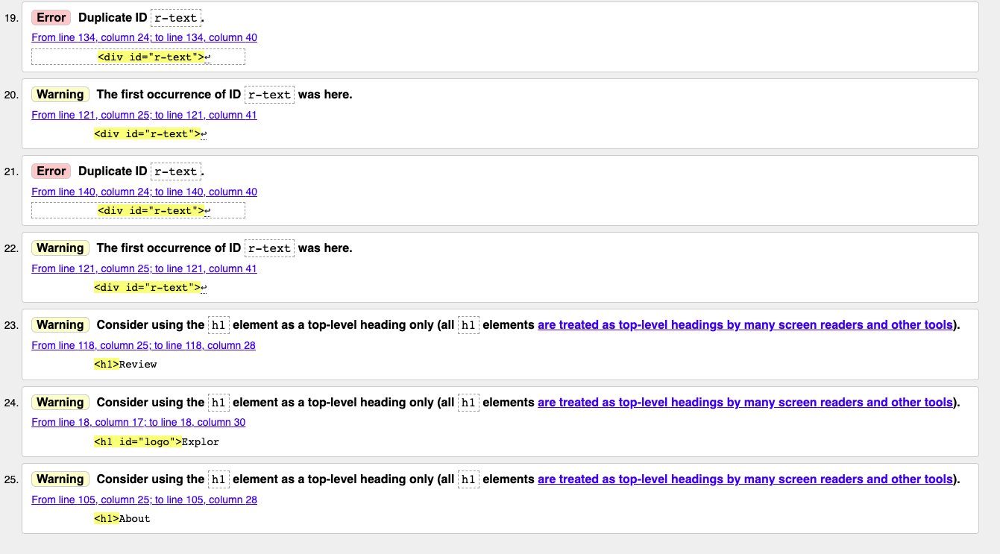
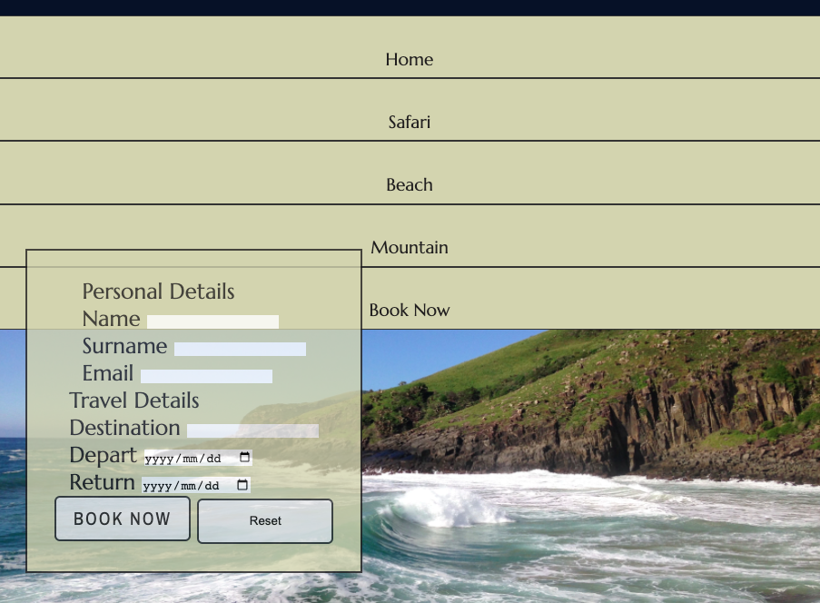
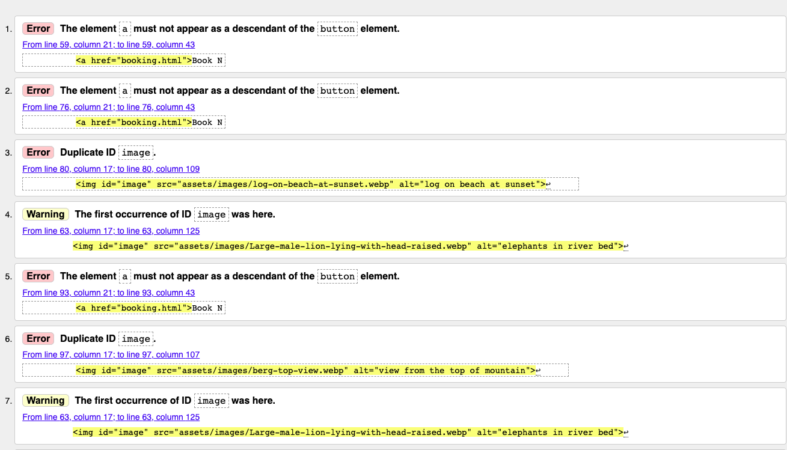
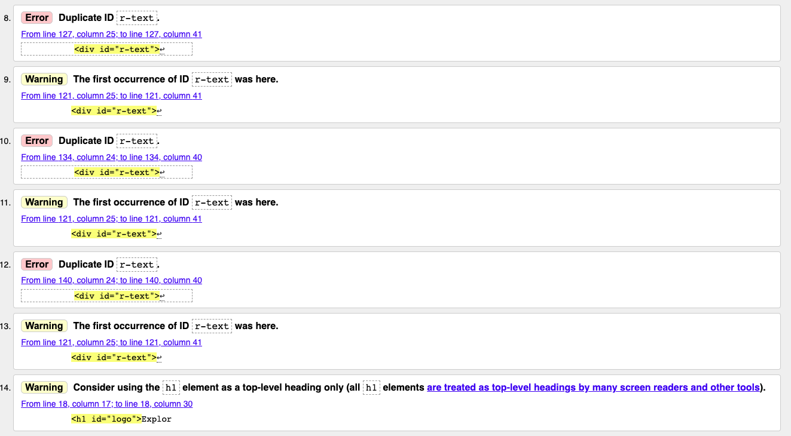

# Explore South Africa # 

Explore South Africa is a site that hopes to get people wanting to go on holiday in South Africa to book their holiday through this website. The purpose of the site is to get people interested in a holiday offered by Explore South Africa and to book one of those holidays. It offers 
 
3 different Destinations:
1. Safari 
2. Beach 
3. Mountain 
 
By offering all three destinations through this one site it hopes to make booking a holiday very easy for first time holiday makers who are unsure of where to go and need a bit of advice on what is available in South Africa. 
 
For returning visitors it hopes to makes the re-booking process very easy and also offer new possibilities that customers may not have known about or considered before hand, while giving them the peace of mind knowing they will be going to a new place with a company they already love and trust. 
 
The site makes use of images and a brief description of each destination to help prospective holiday makers get a better understanding of what to expect. Followed by more in depth pages for each individual destination for those who need a bit more information. These pages make use of a gallery of images to help better sell the destination. 

 
##  Existing Features ##

### Nav Bar ###
       - The Nav bar is show at the top of all of the sites pages. It has links to the Home, Safari, Beach, Mountain and Book Now pages and clicking on the Explore South Africa heading will also take you back to the home page. 
       - All the links are present on all the pages to allow for easy navigation throughout the site and complete control from any page to navigate anywhere on the site easily. 
 
    
### Head Images ###

- Each page has a unique and eye catching photograph to show the user what page they are on and elicit a positive response toward each of the destinations and what the user might expect to see or experience on their upcomming holiday. 
 
#### Home Page ####
  
    - The home page has a photograph below the header to introduce users to the site and encourage them to keep     exploring more of the site in search of a holiday they will want to go on and experiences they could have by taking one of these holidays. 
    

#### Safari Page ####
     - This page has an attractive photograph of zebras on a road at sunset taken from a safari vahicle. The image grabs the attention of would be safari goers and shows them exactly what they might be able to expect from a safari holiday. 

 
#### Beach Page ####
      - As with the previous pages this image also captures the interest of the user and depicts someone on holiday at the beach allowing users to place themselves there too. 

 
#### Mountain Page ####
     - Users are immediately greated with a dramatic mountain view giving them the impression of what it would be like to stay in a place sourrounded by the beauty. It draws users straight in a gives them a positive and descriptive idea of what a holiday in the mountains could be like. 

 
### Destination Section ###
     - This section draws users to all the different available holidays and allows users the opportunity to see them all alonside eachother with a brief description and photograph of each, as well as a **book now** call to action button. This takes users directly to a booking page for their chosen holiday, providing a positive user experience.
     - The arrangement of all three together gives returning visitors different options for booking a new holiday or allows them to easily locate the same holiday as before for repeat bookings. This adds value to the user by preventing them from having to search through multiple menus and pages before finding what they want.  
     - Each section title is annotated with a font awesome icon and when hovered over zooms in to show it is a clickable link to the respective destination pages for users wanting a bit more information before they proceed with booking their holiday or for returning users wanting to read more and look at the gallery of photographs. This gives users quick access to their specific holiday destination pages. 
     - The text bellow these headings provides a brief inticing description of each holiday destination which helps to build user curiosity and excitement and ultimately increase user experience and enjoyment of the site. 
     - The book now buttons are placed directly below this description to encourage quick and easy decisions on a holiday and also help users who have made their minds achieve their goal of booking a holiday with ease. Preventing navigating through multiple menus and pages. 
     - It is good for returning users as they can go directly to Booking page from these buttons.
     - The images below these button provide another visual que and positive experience for users. 
     - This is the main section of the site that draws users in and helps them to make a decision and also gives them confidence to book through this website. It has a good clear clean finish giving confidence and trust to users. While also being easy to navigate and understand wether it is a first time or returning visitor to the site. 

 
#### About Us & Reviews ####
      About Us
        - This section provides users with a bit more of a description of the company and what they can expect if they     choose to travel with this company. 
        - Details about the accomodation style and luxury level are described for users.
        - Authenticity of the type of experience they will be recieving by using local staff and guides will comfort users in knowing they will be well looked after and for first time users are more likely to get a true experience of somewhere they haven't been before while still maintaining a high level of quality. 
        - The information is portrayed using a clear and readable font, Marcellus, that is common throuhout the site which helps with the enjoyment of the user as well as the flow of the site as a whole. 
        - Font color has been carefully chosen to be clearly visible while having a slightly more gentle appearance giving a more calming UX. 
        - The background is white allowing for the clean and crisp feel that runs throughout the site. Background and font work seemlessly together allowing for user optimisation and enjoyment. 
        - Heading and body fonts were also selected using Font Joy (https://fontjoy.com) which pairs fonts together to increase UX. Once the pairing had been found these were selected from google fonts. 
    Reviews 
      - Reviews also utilize the same font style, sizes and colors to keep the site consitent and user friendly.
      - Each review has been placed in its own scrollable box so as not to take up to much space on a screen but to still be very easily accessible to users wanting to know more and check on reviews. 
      - While it is found near the bottom of the page it is still on the home page as the importance of reviews for users is high. 
      - Showing the reviews on the home page helps to build a sense of trust for users and will make them more likely to interact positively with the site and get them to the desired booking page. 

 
### Footer ###
   - The footer is found on the bottom of all the pages of the site, providing a visibly appealing consistency throughout the site. 
   - The background color is a deep blue with a light slightly oakey color for the social media icons which again provides a very pleasing appearance and feel for users. 
   - The header and footer sections both have the same background and font colors adding to the consistency of the site. 
   - Links to social media pages for the site open in a new window providing users with a quick easy way back to the site once they have scrolled through the social media pages without loosing where they were on the site before they left. 

 
## Destination Pages ##
        - The three destination pages namely: Safari, Beach and Mountain all follow the same structure to provide users with a consistent and easily understandable experience. This includes color and font styles. 
        - The consistency gives value to the user by allowing them to quickly gain understanding of how the site works, making it feel very intuitive and leaving the user with a positive experience. 
        - Each section begins with a description of the specific destination which the user may be interested in, which helps to achieve the purpose of the site by directing users in the direction of booking their holiday. 
        - These sections are all a bit longer and more informative for the user who might not yet be sure or may want to compare the different destinations to make the best choice for them when booking their holiday. The menu at the top of the page again allows users to quickly and intuitively navigate through the different destinations or directly to the booking page. 
        - Bellow all of the information sections is a gallery showcasing some the highlights from each of the destinations. The top of the gallery is visible on the same page as the destination information encouraging users to keep scrolling. The purpose of this is to showcase some of these amazing images knowing it will make users more excited about going on holiday and experiencing the same things they are seeing in these images. Leaving users feeling positive about the sight and their experiences of it. 

 

 

 

 
## Book Now ##
     - As the purpose for where we want users to end up this page is very clean simple and usable. 
     - A good clean background image leave users feeling very peaceful and instills confidence in their ultimate decision which has led them booking their holiday. 
     - The form is very simple and easy to fill out, making use of autofill for most of the sections. 
     - The book now button at the bottom is obvious and easy to find. styling fits in with book now buttons from the home page. Giving users more of a peace of mind and making the site very intuitive. 
     - Form sections have been kept to a bare minimum not wasting any time and keeping users engaged and interested in the site. 
     - The color for the form background are the same as the heading and nav and social media text which provides re-assurance to users about to book their holiday. 

 
## Features left to implement ##
    - In future I would like to implement book now buttons at the bottom of each of the destination pages, to allow quicker and easier booking for thos looking at these pages.
    - I would also like to make the header stay fixed at the top of the page and have the content slide under it as you scroll down each page, so the menu is constantly available and a easy click away. 

# Testing #
#### Original Plans ####
The original testing came in the form of drawn plans on paper to try and plan out how exactly I wanted the site to look and then how I was going to achieve that using different containers and methods to do this. All these plans were tested using html and css. Below are photos of those plans as well as my final container I decided to use. 

 

#### Physical Testing ####
All testing was done using iphone, samsung galaxy, pixel 5 ipad, surface-pro, nest hub and laptop and tv screens. 

- During testing the css to align the destination column was very difficult as there was a different amount of text in each. So giving it a height value of auto made it sit un-aligned. 
- I tried giving it a fixed value but this either made it have to big a gap between the text and the button or once the screen size got smaller the text would overlap the button and not work properly. 
- To solve this I ended up using a fixed value and then used media queries to adjust the height until I turned the column into rows where i could then use a height of auto again which made the content fit well. 
- While switching from column to row was good for the text content on bigger screens the width of the images in the destination sections became to wide and stretched the images badly. 
- I used media queries and instead of having 100% width I used 60vw @ max-width 1024px and then 80vw @ max-width 768px as the screen sizes decreased and images could fill the screen width better. 

- Once i began trying the site on different size screens it was clear the nav bar wasnt going to fit and it pushed itself down under the explore south africa heading. 
- I had to add a hamburger menu and re-style the header to make sure it had the same colors and style as before. 
- While making the screen smaller the heading for explore south africa also got to big and didnt fit on one line in small screens so I added a media query to make the font-size smaller for smaller screens to allow it to fit on one line. 
- Gallery sections with larger screen didn't work well with 3 columns as the images wouldnt line up properly and kept leaving gaps. 
- I made the column count 4 and the images fitted much better and taller images had space to also display properly. 
- I also used media queries to reduce the column count as the screen got smaller. 

- Margin between social media icons was causing one link to be pushed down below the footer container. Using media queries I reduced the margin to let it all fit.

- The booking form upon re-sizing the screen left a big gap on the left of the screen but was up against the right side of the screen. I changed the margin to make it more central when used on smaller screens. 

- the opacity of the booking form was also to clear on smaller screens so I increased mine from 0.6 to 0.8 and found it much better. 
- Originaly i had the four review blocks set to 25vw hoping that would cover the whole container div well, however this did not fit and i had to reduce the width of the containers which has fixed the problem.

 
Other testing was conducted as the code was being written. I would write out code one instruction at a time and test that until what I wanted to achieve was achieved. 

#### Lighthouse Reports ####

## Validator Testing ##
## W3C Markup Validating ##
## Fixed Bugs ##

Original problems found when conducting W3C validator testing. Most of these problems were rectified and re-tested. 
## Unfixed Bugs ##
* Hamburger menu on booking page opens behind the form. Tried using different containers and styling to change this but could not get it to change. 

#### Reason Bugs aren't Fixed ####
    - Error with anchor element as decendant of button, left unchanged because I need the button to be a clickable link.
    - Duplicate image id was used because I wanted to style multiple images with the same styling.
    - Duplicate r-text id was used because there are multiple text paragraphs that I wanted to style the same. 
    -Used h1 not only for top level heading but further down in the page to maintain consistent styling of heading through the page. 
## Jigsaw CSS ##

# Deployment #

# Credits #
## Content ##
* andbeyond.com. Text content for Safari, Beach and Mountain sections was taken and adapted from some of their holiday destinations.
* Codepen.io to practice and test code and the way it behaved before adding it to my site. 
* CSS-tricks.com-a guide to flexbox. Used the reference guide to implement flex styling in my css.
* Freecodecamp.org-media queries. used the common breakpoints from here to implement my testing and used it as a guide to use media queries correctly.
* Alvarotrigo.com - hamburger-menu-css. I used one of these examples to add a hamburger menu to my site. 
## Media ##
### Images ###
        * Images were used from my own personal library of photographs I have taken as well as friends and family. 
        * Photographers were
             - Matt Smith
             - Charles Henderson 
             - Dylan Henderson 
* Cloudconvert.com was used to convert all of my images to webp format.
* Font Awesome was used for the icons on the Safari, Beach and Mountain section as well as the social media links in all the footers.
* Balsamiq wireframes to design the original layout of the project.
* Willmaster.com divs with background images used this as a guide to implement the background image on the booking form specifically. 
### Font & Colors ###
* Fontjoy to generate and select a font pairing that suited eachother.
* Google Fonts to actually apply those fonts to my site. 
* RGB color picker to choose my colors and then get the exact values for them. 